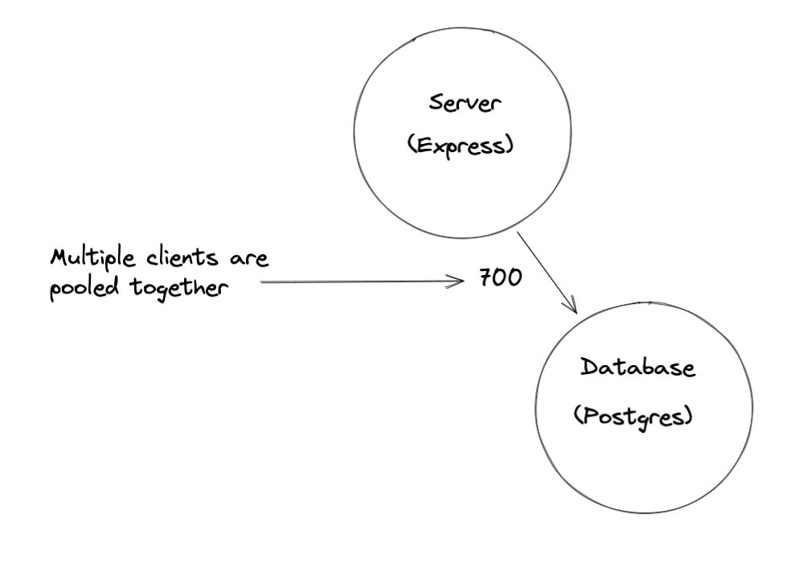

# System-Design

Worked with a team of engineers to refactor an old monolithic system into a microservice system. Increased overall RPS (request per second) by 2000% under the constraints of no more than 1% error rate and no longer than 80 ms average response time.

The above design is my system for my microservice. This server system was intended for an eccomerce website and I had worked on the reviews API calls.

This could handle about 375 RPS (requests per second) at 72 ms (milliseconds) average response time. To improve on the system, I added in caching and pooling.

*Caching*

*Pooling*

The above images show how caching and pooling works in the overall system. If the load balancer recognizes a certain request, it'll immediately fire back a cached response. Naturally, this could cause some potential errors with updated information.However, since this specific API call is for the reviews portion, prioritizing eventual consistency over immediate consitency is more effective.

Each server will recognize if there are multiple requests being sent to them by the load balancer. When multiple requests are sent, the clients will be pooled together so that only one connection needs to be made with the database. After all clients have completed their queries, the clients will be released and the connection with the database will be closed.

# Conclusion

The final system was able to handle 3000 RPS at 74 ms average response time which is over 2000% increase in RPS compared to the old monolithic system. This was a pretty fun project as I was able to see ever increasing numbers with each optimization. I do think that in the future, I could probably improve on this system and be able to hit the same numbers but with less servers!
